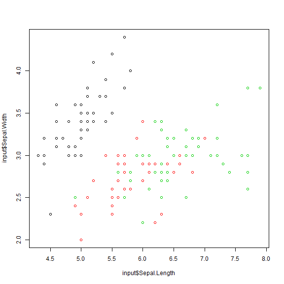

Vervangen Excel copy-paste straten
========================================================
author: Martin van Elp
date: 2019-05-19
autosize: true


Agenda
========================================================

1. Beginsituatie
2. Inlezen
3. Bewerken
4. Wegschrijven
5. Alles tezamen
6. Wvttk
7. Oefenen (facultatief)

Stel vragen! Sommige dingen laat ik dan meteen interactief zien of anders later.


Beginsituatie
========================================================

Stereotype verwerking met Excel:

- Levering van een bestand (map, e-mail, ...)
- Bestand openen (Excel, Access, SPSS, ...)
- Tabel kopi&#235;ren en plakken in inputtabblad eigen Excel
- Excel-formules bewerken de data
- Tabel/uitkomst uit outputtabblad overnemen/kopi&#235;ren/inlezen

Arbeidsintensief en gevoelig voor incidentele fouten.


Inlezen 1/5
========================================================

Een Excel bestand


```r
xlsx_bestand <- system.file(
    "extdata",
    "datasets.xlsx",
    package = "readxl")

xlsx_bestand
```

```
[1] "C:/Users/mvane/Documents/R/win-library/3.5/readxl/extdata/datasets.xlsx"
```

Bestand bekijken in Excel


```r
openxlsx::openXL(xlsx_bestand)
```


Inlezen 2/5
========================================================

Tabel uit bestand inlezen


```r
input <- readxl::read_excel(
    xlsx_bestand,
    sheet = "iris")

head(input)
```

```
# A tibble: 6 x 5
  Sepal.Length Sepal.Width Petal.Length Petal.Width Species
         <dbl>       <dbl>        <dbl>       <dbl> <chr>  
1          5.1         3.5          1.4         0.2 setosa 
2          4.9         3            1.4         0.2 setosa 
3          4.7         3.2          1.3         0.2 setosa 
4          4.6         3.1          1.5         0.2 setosa 
5          5           3.6          1.4         0.2 setosa 
6          5.4         3.9          1.7         0.4 setosa 
```


Inlezen 3/5
========================================================

Nog een Excel bestand


```r
xlsx_bestand2 <- system.file(
    "readTest.xlsx", 
    package = "openxlsx")

xlsx_bestand2
```

```
[1] "C:/Users/mvane/Documents/R/win-library/3.5/openxlsx/readTest.xlsx"
```

Bestand bekijken in Excel


```r
openxlsx::openXL(xlsx_bestand2)
```


Inlezen 4/5
========================================================

Tabel uit bestand inlezen


```r
input2 <- openxlsx::read.xlsx(
    xlsx_bestand2
    , sheet = 3
    , skipEmptyRows = TRUE
    , detectDates = TRUE)

head(input2)
```

```
        Date     value      word  bool  wordZ2
1 2014-04-28 0.8390764 N-U-B-R-A FALSE FALSE-Z
2 2014-04-27 0.8863800 N-Z-P-S-Y  TRUE  TRUE-Z
3 2014-04-26 0.5741314 C-G-D-X-H  TRUE  TRUE-Z
4 2014-04-25 0.1366065      <NA> FALSE FALSE-Z
5 2014-04-24 0.3692582 B-K-A-O-W  TRUE  TRUE-Z
6 2014-04-23        NA H-P-G-O-K  TRUE  TRUE-Z
```


Inlezen 5/5
========================================================


Werken met bestanden


```r
bestanden <- list.files(path = tempdir(), 
                        pattern = ".tmp")
bestanden
```

```
[1] "bron_2019-01-01.tmp" "bron_2019-01-02.tmp" "bron_2019-01-03.tmp"
```

```r
bestand <- tail(sort(bestanden), 1)
bestand
```

```
[1] "bron_2019-01-03.tmp"
```

```r
paste0(tempdir(), "\\", bestand)
```

```
[1] "C:\\Users\\mvane\\AppData\\Local\\Temp\\RtmpeGa35M\\bron_2019-01-03.tmp"
```

Bewerken 1/3
========================================================

Eenvoudige bewerking


```r
output <- input
output$Sepal2 <- output$Sepal.Length * output$Sepal.Width
output$Petal2 <- output$Petal.Length * output$Petal.Width

head(output)
```

```
# A tibble: 6 x 7
  Sepal.Length Sepal.Width Petal.Length Petal.Width Species Sepal2 Petal2
         <dbl>       <dbl>        <dbl>       <dbl> <chr>    <dbl>  <dbl>
1          5.1         3.5          1.4         0.2 setosa    17.8  0.280
2          4.9         3            1.4         0.2 setosa    14.7  0.280
3          4.7         3.2          1.3         0.2 setosa    15.0  0.26 
4          4.6         3.1          1.5         0.2 setosa    14.3  0.3  
5          5           3.6          1.4         0.2 setosa    18    0.280
6          5.4         3.9          1.7         0.4 setosa    21.1  0.68 
```


Bewerken 2/3
========================================================

Gemiddelde per soort


```r
library(dplyr)

output2 <- output %>%
    group_by(Species) %>%
    summarize_all(funs(mean(., na.rm = TRUE)))

output2
```

```
# A tibble: 3 x 7
  Species   Sepal.Length Sepal.Width Petal.Length Petal.Width Sepal2 Petal2
  <chr>            <dbl>       <dbl>        <dbl>       <dbl>  <dbl>  <dbl>
1 setosa            5.01        3.43         1.46       0.246   17.3  0.366
2 versicol~         5.94        2.77         4.26       1.33    16.5  5.72 
3 virginica         6.59        2.97         5.55       2.03    19.7 11.3  
```


Bewerken 3/3
========================================================

Analyseren


```r
plot(x = input$Sepal.Length,
     y = input$Sepal.Width,
     col = as.factor(input$Species))
```




Wegschrijven 1/3
========================================================


```r
dir <- tempdir()

# simpel wegschrijven naar een CSV
write.csv2(
    output2, 
    file = paste0(dir,"\\","verwerkt.csv"))

# simpel wegschrijven naar een Excel
writexl::write_xlsx(output2, 
                    path = paste0(dir,"\\","verwerkt.xlsx"))
```

.

Hoe ziet die Excel er uit?


```r
openxlsx::openXL(paste0(dir,"\\","verwerkt.xlsx"))
```


Wegschrijven 2/3
========================================================

Datum in bestandsnaam


```r
naam  <- "output"
datum <- format(Sys.Date(), "%Y-%m-%d")

paste0(naam, "_", datum, ".tmp")
```

```
[1] "output_2019-05-19.tmp"
```


Wegschrijven 3/3
========================================================

Het package **openxlsx** biedt veel meer mogelijkheden:

- Layout wijzigen, zoals kleuren en tekstversiering;
- Conditionele opmaak
- ...en meer.

Zo kun je dus ook output voor maatwerk maken, zonder zelf in Excel te werken.

Nieuwsgierig?


```r
?openxlsx
```


Alles tezamen
========================================================


```r
library(dplyr)

# verwijzing naar het bronbestand 
xlsx_bestand <- system.file("extdata", "datasets.xlsx", package = "readxl")

# bronbestand inlezen
input <- readxl::read_excel(xlsx_bestand, sheet = "iris")

# input bewerken
output <- input %>%
    mutate(Sepal2 = Sepal.Length * Sepal.Width,
           Petal2 = Petal.Length * Petal.Width) %>%
    group_by(Species) %>%
    summarize_all(funs(mean(., na.rm = TRUE)))

# output wegschrijven
dir <- tempdir()
datum <- format(Sys.Date(), "%Y-%m-%d")

writexl::write_xlsx(output, path = paste0(dir,"\\","verwerkt_", datum, ".xlsx"))
```


Disclaimer
========================================================

Alternatieven met Excel:

- querie&#235;n (Power Query) op bestand of database, met als resultaat een tabel;
- celverwijzingen naar een bestand en dan telkens bijwerken.

Nadelen van R:

- minder geneigd tijdens het werk "ff" iets aan te passen/verbeteren; 
- structurele fouten (bv. fout in formule) blijven zitten als ze niet opvallen.

Wvttk
========================================================


Oefenen
========================================================

<center>
Voor wie wil: 

**Pak eigen bestanden en ga aan de slag**

<font color="red">(voor wie met productiedata werkt: maak een kopie!)</font>

.

*Ik loop rond om mee te denken en te helpen.*
</center>
