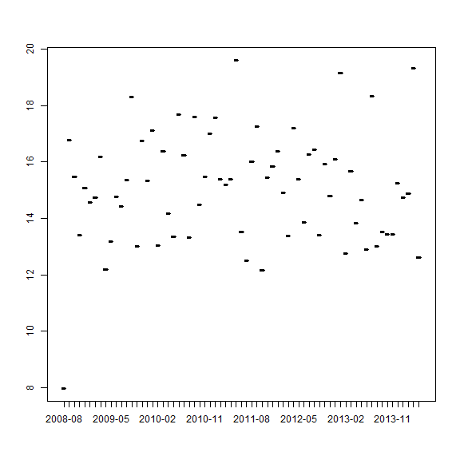

Vervangen Excel copy-paste straten
========================================================
author: Martin van Elp
date: 2019-02-11
autosize: true


Agenda
========================================================

1. Beginsituatie
2. Inlezen
3. Bewerken
4. Wegschrijven
5. Disclaimer
6. Oefenen (facultatief)


Beginsituatie
========================================================

Stereotype verwerking met Excel:

- Levering van een bestand (map, e-mail, ...)
- Bestand openen (Excel, Access, SPSS, ...)
- Tabel kopi&#235;ren en plakken in inputtabblad eigen Excel
- Excel-formules bewerken de data
- Tabel/uitkomst uit outputtabblad overnemen/kopi&#235;ren/inlezen

Arbeidsintensief en gevoelig voor incidentele fouten.


Inlezen 1/3
========================================================

Een Excel bestand


```r
xlsx_bestand <- system.file(
    "extdata",
    "datasets.xlsx",
    package = "readxl")

xlsx_bestand
```

```
[1] "C:/Users/mvane/Documents/R/win-library/3.5/readxl/extdata/datasets.xlsx"
```

Bestand bekijken in Excel


```r
openxlsx::openXL(xlsx_bestand)
```


Inlezen 2/3
========================================================

Tabel uit bestand inlezen


```r
input <- readxl::read_excel(
    xlsx_bestand,
    sheet = "iris")

head(input)
```

```
# A tibble: 6 x 5
  Sepal.Length Sepal.Width Petal.Length Petal.Width Species
         <dbl>       <dbl>        <dbl>       <dbl> <chr>  
1          5.1         3.5          1.4         0.2 setosa 
2          4.9         3            1.4         0.2 setosa 
3          4.7         3.2          1.3         0.2 setosa 
4          4.6         3.1          1.5         0.2 setosa 
5          5           3.6          1.4         0.2 setosa 
6          5.4         3.9          1.7         0.4 setosa 
```


Inlezen 3/3
========================================================


Werken met bestanden


```r
bestanden <- list.files(path = tempdir(), 
                        pattern = ".tmp")
bestanden
```

```
[1] "bron_2019-01-01.tmp" "bron_2019-01-02.tmp" "bron_2019-01-03.tmp"
```

```r
bestand <- tail(sort(bestanden), 1)
bestand
```

```
[1] "bron_2019-01-03.tmp"
```

```r
paste0(tempdir(), "\\", bestand)
```

```
[1] "C:\\Users\\mvane\\AppData\\Local\\Temp\\RtmpmICnbv\\bron_2019-01-03.tmp"
```


Bewerken 1/2
========================================================

Gemiddelde per soort


```r
library(dplyr)

output <- input %>%
    group_by(Species) %>%
    summarize_all(funs(mean(., na.rm = TRUE)))

head(output)
```

```
# A tibble: 3 x 5
  Species    Sepal.Length Sepal.Width Petal.Length Petal.Width
  <chr>             <dbl>       <dbl>        <dbl>       <dbl>
1 setosa             5.01        3.43         1.46       0.246
2 versicolor         5.94        2.77         4.26       1.33 
3 virginica          6.59        2.97         5.55       2.03 
```


Bewerken 2/2
========================================================

Analyseren


```r
plot(x = input$Sepal.Length,
     y = input$Sepal.Width,
     col = as.factor(input$Species))
```




Wegschrijven 1/2
========================================================


```r
dir <- tempdir()

# simpel wegschrijven naar een CSV
write.csv2(
    output, 
    file = paste0(dir,"\\","verwerkt.csv"))

# simpel wegschrijven naar een Excel
writexl::write_xlsx(output, 
                    path = paste0(dir,"\\","verwerkt.xlsx"))
```

.

Hoe ziet die Excel er uit?


Wegschrijven 1/2
========================================================

Datum in bestandsnaam


```r
naam  <- "output"
datum <- format(Sys.Date(), "%Y-%m-%d")

paste0(naam, "_", datum, ".tmp")
```

```
[1] "output_2019-02-17.tmp"
```


Disclaimer
========================================================

Alternatieven met Excel:

- querie&#235;n (Power Query) op bestand of database, met als resultaat een tabel;
- celverwijzingen naar een bestand en dan telkens bijwerken.

Nadelen van R:

- minder geneigd tijdens het werk "ff" iets aan te passen/verbeteren; 
- structurele fouten (bv. fout in formule) blijven zitten als ze niet opvallen.


Oefenen
========================================================

<center>
Voor wie wil: 

**Pak eigen bestanden en ga aan de slag**

<font color="red">(voor wie met productiedata werkt: maak een kopie!)</font>

.

*Ik loop rond om mee te denken en te helpen.*
</center>
